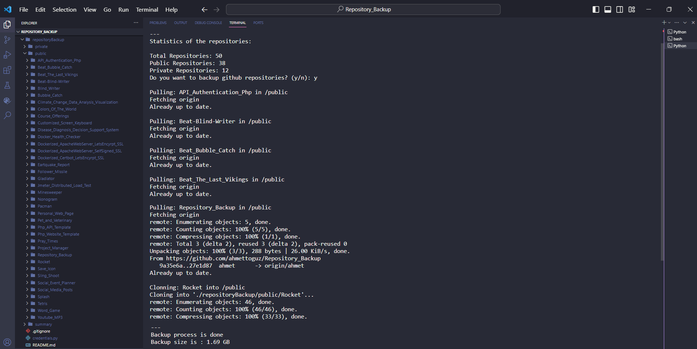

<h1 id="mainHeader" align="center">Github Repository Backup</h1> 

<br>

<div align="center">
    
</div>

<br/>

## Table of Contents

- [Introduction](#introductionHeader)
- [Demo](#demoHeader)
- [Technologies](#technologiesHeader)
- [Features](#featuresHeader)
- [Prerequisites](#prerequisitesHeader)
- [Instructions](#instructionsHeader)
- [Contributors](#contributorsHeader)

<br/>

<h2 id="introductionHeader">📌 Introduction</h2> 

This project facilitates the creation of backups for your private and public GitHub repositories.

<br/>

<h2 id="demoHeader">🚀 Demo</h2> 

<div align="center">
    
</div>

<br/>

<h2 id="technologiesHeader">☄️Technologies</h2> 

[](https://www.python.org/)

[](https://github.com/ahmettoguz)

<br/>

<h2 id="featuresHeader">✨ Features</h2> 

* Private and public repositories can be backed up.
  
* Non-existent repositories can be cloned, and existing repositories can be pulled without cloning again.

* Specified repositories can be ignored.

<br/>

<h2 id="prerequisitesHeader">🔒 Prerequisites</h2> 

* Github access token. (Obtainable from https://github.com/settings/tokens)
  
* Python

<br/>

<h2 id="instructionsHeader">📋 Instructions</h2> 

```
git clone https://github.com/ahmettoguz/Repository_Backup
```

```
bash setCredentials.sh
```

```
bash setIgnore.sh
```

```
python backup.py
```

<br/>

<h2 id="contributorsHeader">👥 Contributors</h2> 

<a href="https://github.com/ahmettoguz" target="_blank"></a>

[🔝](#mainHeader)


